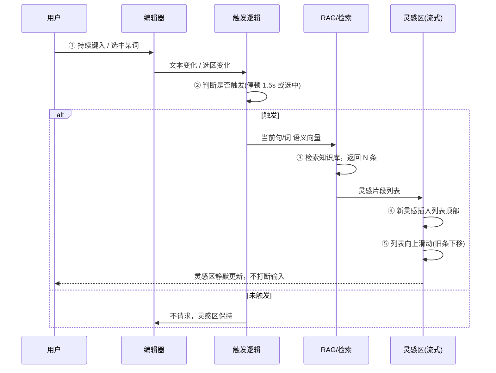

# StyleEvent（风格写作）灵感流 — 主流程原型

灵感区为**流式呈现**：随用户写作，新灵感（纯文本 + 出处）不断加入**中间偏上**区域，列表**向上滑动**（新条在顶部出现，旧条整体下移）。当前界面无侧栏，灵感以纯文本居中偏上展示。

---

## 一、主流程总览（顺序）

```
 ① 用户写作    ② 触发检索    ③ 返回灵感    ④ 插入灵感    ⑤ 列表上滑
    │              │              │              │              │
    ▼              ▼              ▼              ▼              ▼
┌─────────┐  ┌─────────┐  ┌─────────┐  ┌─────────┐  ┌─────────┐
│ 键入/   │  │ 停顿或   │  │ RAG 语义 │  │ 新灵感  │  │ 灵感区内 │
│ 选中词  │→ │ 选中词   │→ │ 检索     │→ │ 插入    │→ │ 容上滑   │
│         │  │ 触发     │  │ 知识库   │  │ 顶部    │  │ 展示     │
└─────────┘  └─────────┘  └─────────┘  └─────────┘  └─────────┘
```

**顺序**：1 → 2 → 3 → 4 → 5（循环：用户继续写则重复 1～5）。

---

## 二、流程图（详细）



---

## 三、分步说明（带注释）

| 步骤 | 名称 | 说明 | 注释 |
|------|------|------|------|
| **①** | 用户写作 | 用户在编辑区键入内容，或选中已有文字（词/句）。 | 输入是「语义检索」的源头，不依赖提示词。 |
| **②** | 触发检索 | 满足其一即触发：**停顿超过约 1.5s**，或**选中一个词/一段话**。 | 避免每打一字就请求，减少干扰与请求量。 |
| **③** | 返回灵感 | 后端用当前句/词做语义检索（RAG），从配置的知识库返回若干条**有出处的**片段。 | 每条带来源（如里耶秦简·古代史库），保证「有据可查」。 |
| **④** | 插入灵感 | 新灵感以**纯文本（+ 小字出处）**形式插入灵感区**顶部**（最新在上）。 | 顶部插入才能产生「新内容在上、整体上滑」的流式感。 |
| **⑤** | 列表上滑 | 灵感区内列表**向上滑动**：新条在顶部，已有条整体下移；可设置最大条数，超出则底部移除或折叠。 | 「向上滑动」= 视觉上内容往上走，新来的在眼前。 |

---

## 四、图示：灵感区「向上滑动」含义

```
时间 T1（用户刚写完「很累」并停顿）
┌─────────────────────┐
│ 灵感 · 回响         │
│ 与「累」相关        │
├─────────────────────┤
│ [A] 戍卒之苦…       │  ← 刚插入（新）
│ [B] 钝化、氧化      │
│ [C] 某种虚无…       │
└─────────────────────┘

时间 T2（用户又写了「夕阳」并停顿，新检索到 2 条）
┌─────────────────────┐
│ 灵感 · 回响         │
│ 与「夕阳」相关      │  ← 上下文提示更新
├─────────────────────┤
│ [D] 残阳如血…       │  ← 新插入，列表「向上滑」
│ [E] 瑞利散射…       │  ← 新插入
│ [A] 戍卒之苦…       │  ← 原顶部下移
│ [B] 钝化、氧化      │
│ [C] 某种虚无…       │
└─────────────────────┘
```

**注释**：新条 D、E 插入**顶部**，A/B/C 整体**下移**，视觉上即「灵感区向上滑动」的流式呈现。

---

## 五、触发条件（可配置）

| 触发方式 | 说明 | 建议默认 |
|----------|------|----------|
| **停顿时长** | 停止输入超过 N 秒后自动检索当前句/段。 | 1.5 s |
| **选中文本** | 用户选中一个词或一段话即触发检索。 | 开启 |
| **手动刷新** | 灵感区提供「刷新」按钮，用户主动要新灵感。 | 可选 |

---

## 六、原型顺序小结（给交互/开发）

1. **用户输入** → 编辑器监听内容与选区。
2. **触发判断** → 若「停顿 ≥ 1.5s」或「有选区」，则发起请求。
3. **请求** → 把当前句/词（或选区）发给 RAG，带知识库/风味配置。
4. **响应** → 拿到若干条「文本 + 出处」。
5. **插入** → 每条生成一条灵感（纯文本+出处），按顺序插入灵感区**顶部**。
6. **动效** → 灵感区列表向上滑动（新在顶，旧下移），上下文提示更新为当前检索词/句。
7. **循环** → 用户继续写 → 重复 1～6。

---

## 七、技术约束与表现目标

流程体验依赖以下技术约束，具体指标与降级策略见 **《Echo-产品需求与指标》**。

| 约束 | 目标 | 说明 |
|------|------|------|
| **延迟** | 触发 → 灵感区首条可见：**P95 &lt; 1.2s**（MVP），后续 &lt; 800ms | 超时 2s 降级为空，不阻塞编辑、不弹窗报错。 |
| **出处** | **100%** 来自真实入库片段 | 每条灵感必带来源（库名/书名），禁止编造。 |
| **空结果** | 返回 0 条时灵感区保持上一状态或显示「未找到相关片段」 | 不伪造内容。 |
| **请求取消** | 用户再次触发时取消上一次未完成请求，只保留最新一次 | 避免旧结果覆盖新结果。 |

---

## 八、Figma 原型可画的几帧（建议）

| 帧 | 内容 | 用途 |
|----|------|------|
| **F1** | 空状态：灵感区只有「灵感 · 风格写作」+「继续写，相关片段会出现在这里」 | 未触发时 |
| **F2** | 第一次触发：出现 1～3 条灵感（纯文本+出处），上下文「与「累」相关」 | 首次检索 |
| **F3** | 第二次触发：顶部新增 2 条，原条下移（箭头注「向上滑动」） | 流式 |
| **F4** | 列表较长：5～6 条，灵感区可滚动（标注「可滚动」） | 容量与滚动 |
